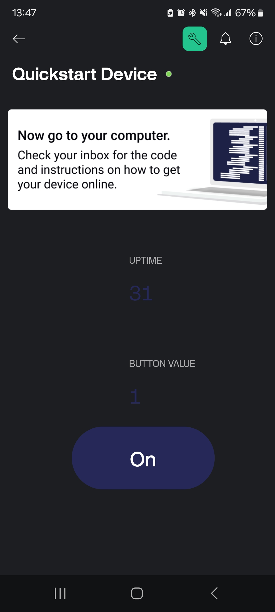

# Lab 10: ESP8266 Board & Cloud IoT (Blynk)

## Objective

Connect an ESP8266 (NodeMCU) to the Blynk cloud and build a simple remote-control interface for the onboard LED. You will:

* Blink the onboard LED via a Blynk app **Switch** widget (V0)
* Echo the switch state in a **Value Display** widget (V1)
* Send the board’s uptime (in seconds) to a **Value Display** or **Gauge** widget (V2)

## Hardware

* ESP8266 NodeMCU (ESP-12E) board
* Micro-USB cable (data & power)
* Smartphone with Blynk IoT app installed

## Software & Libraries

* Arduino IDE (latest)
* **ESP8266** board support in Arduino IDE
* **Blynk** library (official by Volodymyr Shymanskyy)

## Wi-Fi Configuration

We used an **open (no-password) 2.4 GHz** SSID so the ESP8266 could join without requiring credentials in code:

```cpp
char ssid[] = "optix_legacy";  // your open 2.4 GHz network
```

> **Note:** ESP8266 cannot see 5 GHz networks. Ensure your router is broadcasting a 2.4 GHz SSID.

## Blynk Setup

1. Create a device (Quickstart/Template) on [**https://blynk.cloud**](https://blynk.cloud).
2. Copy the **Auth Token**, **Template ID**, and **Template Name** into your sketch *before* any Blynk includes.
3. In the Blynk IoT app, add three widgets:

   * **Switch** → V0 (Switch mode)
   * **Value Display** → V1
   * **Value Display** (or **Gauge**) → V2

## Wiring & Board Notes

* No external wiring required for the onboard LED:

  * **LED\_BUILTIN** on NodeMCU is tied to GPIO2 (D4) and is **active-LOW**.

## Results & Verification

* **Serial Monitor** shows:

  ```
  Connecting to "optix_legacy"...
  ✅ Wi-Fi connected
  10.50.124.88
  [Blynk] v1.x.x
  [Connecting to blynk.cloud:80]
  [Ready (ping: xx ms).]
  ```
* In the **Blynk app**:

  * Toggling the **Switch (V0)** turns the onboard LED on/off.
  * **Value Display (V1)** updates to `1` or `0` matching the switch.
  * **Value Display (V2)** shows elapsed time in seconds.

## Screenshots & Demo Video

1. **Screenshot 1:** Blynk dashboard with Switch (V0), Value Display (V1), and Gauge (V2) **ON**!Alt text](Screenshot_20250629_134754_Blynk_IoT.jpg)
2. **Screenshot 2:** Blynk dashboard with Switch (V0), Value Display (V1), and Gauge (V2) **OFF**
3. **Demo Video:** [**Watch the demo on YouTube**](https://www.youtube.com/watch?v=Y2iu5TG_uY4).

## Troubleshooting

* **“Failed to connect to Wi-Fi”** → ensure SSID is exact, network is 2.4 GHz, and truly open (no captive-portal).
* **“Device offline” in app** → check Auth Token, and watch Serial debug to confirm Blynk connection.

## Conclusion

This lab demonstrated how to bring Wi-Fi microcontrollers into the cloud using Blynk’s template/auth-token model and Virtual Pins. You built a simple IoT dashboard that remotely toggles hardware and monitors uptime—all with under 50 lines of Arduino code.
